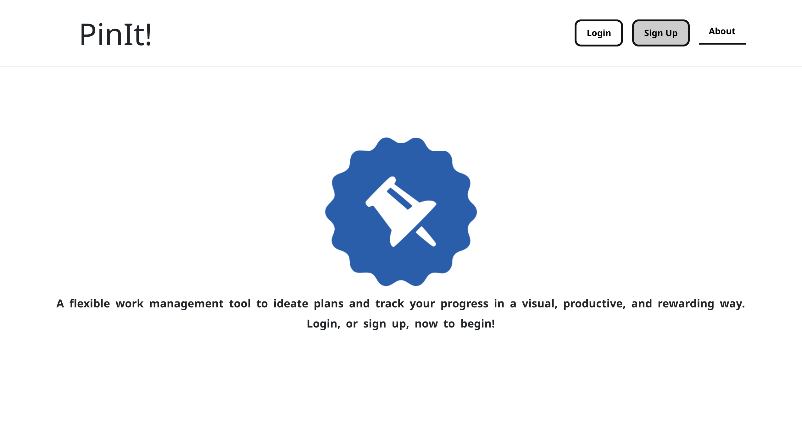
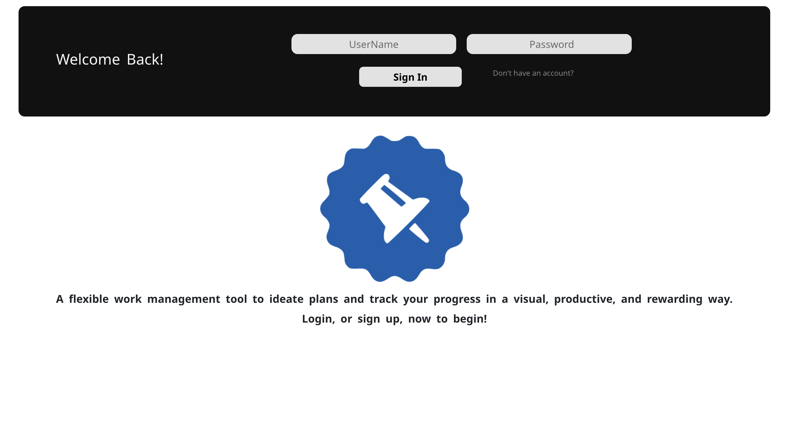
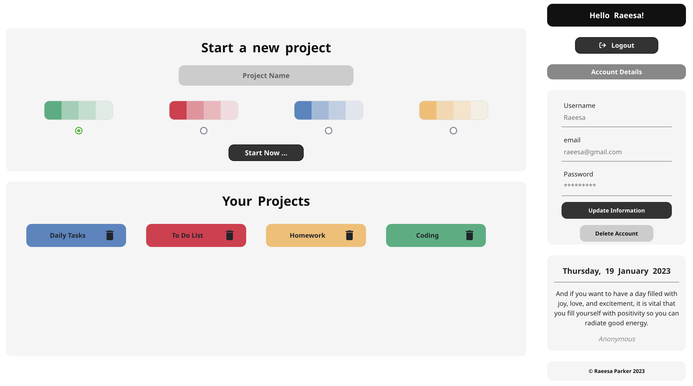
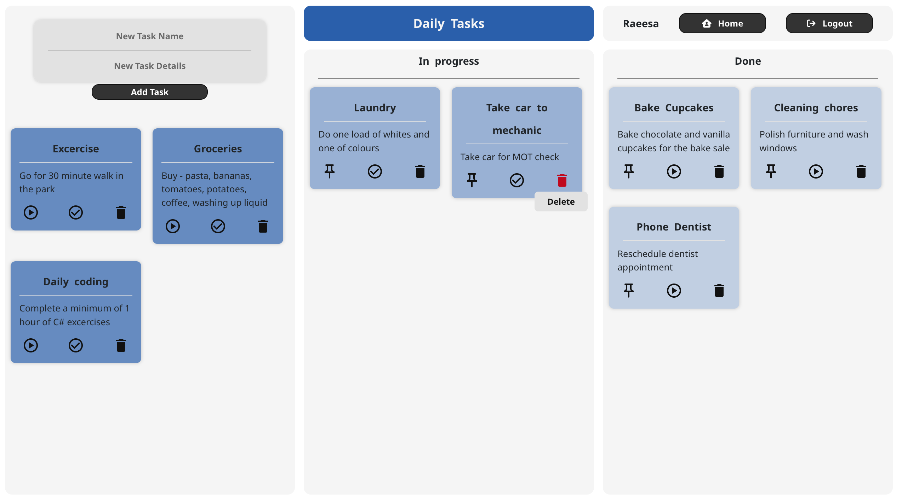

# ToDoList

## General Information
PinIt! is a kanban-style work management tool that can be used to ideate plans and track progress in a visual, productive, and rewarding way.

This repository ([RaeesaParker/toDoList](https://github.com/RaeesaParker/toDoList)) holds the front-end code for the project, whilst the back-end code can be found at [RaeesaParker/toDoList-API](https://github.com/RaeesaParker/toDoList-API) . 

The app is currently hosted at [pinitboard.netlify.app/](https://pinitboard.netlify.app/) . 

## Technologies

### Front-end
- React 18.2 

### Back-end 
- Node.js
- Express 4.18.2
- MySQL 

## Usage
The app is hosted at [https://pinitboard.netlify.app/](https://pinitboard.netlify.app/). 
To use this app, create an account using a username, e-mail, and password. For more information, including screenhots of the app, see below or please visit the About page. 

**To test the app without creating an account, please use the following details:** 

**Username:**   *testuser* 

**password:** *testuser*

## Screenshots
Below are a selection of screenshots of the app.
 

 
 
 

 

 

 
 
 

 

  

