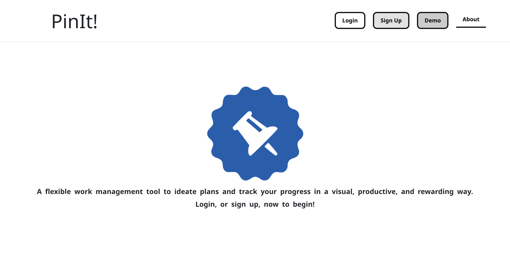

# ToDoList

## General Information
This repository ([RaeesaParker/toDoList](https://github.com/RaeesaParker/toDoList)) holds the front-end code for a trello-like todo board. 

The current deployment only holds the front-end. The back-end is currently in development and the repository can be found at [RaeesaParker/toDoList-API](https://github.com/RaeesaParker/toDoList-API) . 

## Technologies

### Front-end
- React 18.2 

### Back-end 
- Node.js
- Express 4.18.2
- MySQL 

## Usage
The app is hosted at [raeesaparker.github.io/toDoList/](https://raeesaparker.github.io/toDoList/). 

## Screenshots
Below are a selection of screenshots of the app.
 

 
 
 

 

 

 
 
 

 

  

